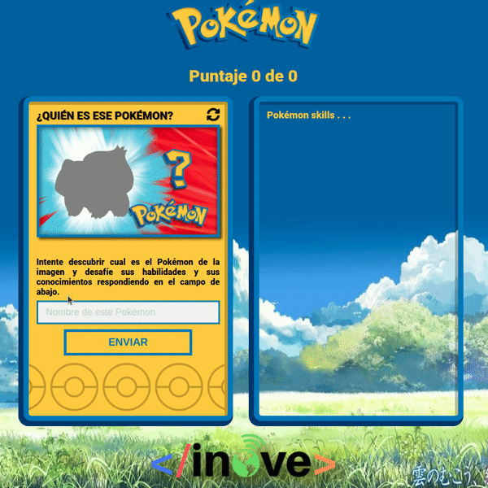

# Tarea

Para esta tarea tenemos como objetivo construir la aplicación de PokeTrivia. La aplicaciñon se irá construyendo a medida que avanzan las clases. A partir de ahora le pediremos siempre trabaje sobre el mismo repositorio donde vaya trabajando en esta aplicación (el repositorio creado a partir de la clase 7).

Cambios y mejoras incorporadas en este release:
- Leer los datos desde la variable JSON "jsonData" en data.js.
- Crear un archivo "model.js", dentro definir un prototipo "Pokemon" que acepte "id" y "name". Dentro de ese prototipo se debe armar el "thumbnail" basado en el "id" (tal como se vio en clase).
- Parsear la variable "jsonData" y armar una lista de "pokemons" prototipo.
- Guardar en los datos de session (sessionStorage) las variables "cantidadAcertados" y "cantidadEncuestados" cada vez que son modificadas. Además, leer el valor de esas variables del "sessionStorage" cuando comienza app.js.

## Desarrollo que debe realizar
#### En archivo app.js
- Ahora deberá leer los datos la variable "JSON" llamado "jsonData" que se encuentra en el nuevo archivo data.js que encontará en este repositorio. Utilice este archivo de data de ahora en más que posee los 151 Pokemons.
- De ahora en más almacenará los datos de los pokemons en un prototipo Pokemon que deberá construir (ver próximo punto).

#### En archivo model.js
- Crear un archivo "model.js", dentro definir un prototipo "Pokemon".
- El prototipo "Pokemon" debe aceptar "id" y "name".
- Dentro de ese prototipo se debe armar el "thumbnail" basado en el "id" (tal como se vio en clase).

#### En archivo events.js
- Guardar en los datos de session (sessionStorage) las variables "cantidadAcertados" y "cantidadEncuestados" cada vez que son modificadas. Además, leer el valor de esas variables del "sessionStorage" cuando comienza app.js.
- Deberá lograr de esta forma que aunque se recargue la pestaña no se pierda el puntaje de la trivia.

## Como se deberá ver su aplicación hasta el momento

#### ¡Ante cualquier duda no dude en contactar al profesor o tutor!.